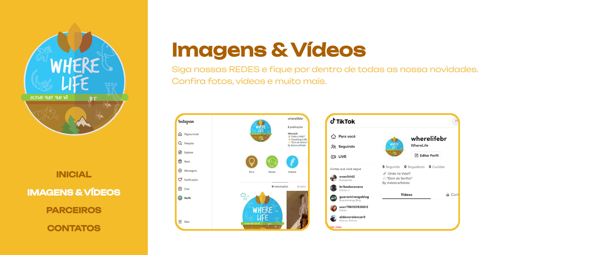
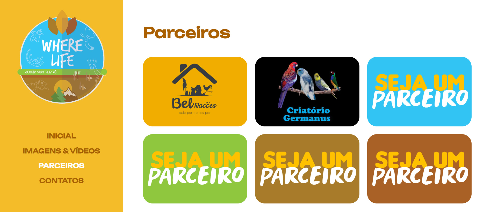
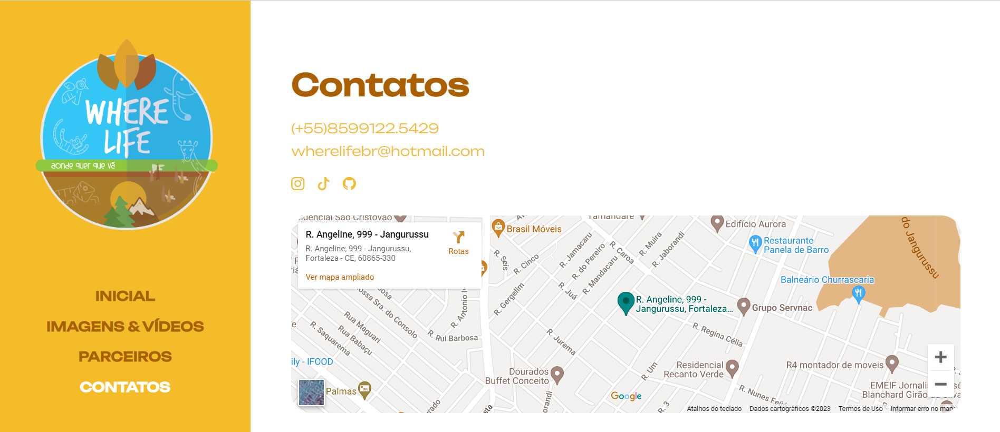

# WereLife - Onde há vida?!
WereLive - Onde há vida?!
Um projeto que traz a relevante vida da fauna.
 

 

  <a href="#tecnologias">Tecnologias</a> |
  <a href="#páginas">Páginas</a>

 
<h2>QR code para ver o site completo</h2>

 

# Tecnologias

Esse projeto foi desenvolvido com as seguintes tecnologias:

 

# Páginas 
 

## Inicial 

## Imagens & Vídeos

## Parceiros

## Contatos

 

# Compartilhamos imagens e vídeos dos animais em seu habitat natural bem como em zoológicos e criatórios devidamente autorizados.
# Contamos com uma geleria especifica para você que quer ser nosso parceiro Free -  Petshop, Criatórios e Casas de Ração.
